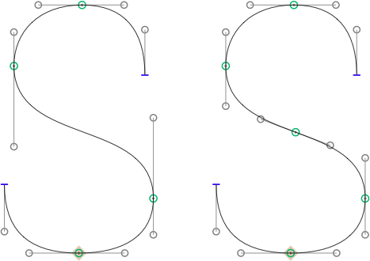

# InsertInflections.glyphsFilter

This is a plugin for the [Glyphs font editor](http://glyphsapp.com/) by Georg Seifert.
It inserts nodes on all inflections of all selected glyphs. This is useful for monoline workflows, where inflected paths need to be expanded to a closed stroke; and for conversion into TrueType outlines.

After installation, it will add the menu item *Filter > Insert Inflections* (de: *Inflektionspunkte einfügen,* fr: *Ajouter les points d’inflexion,* es: *Agregar puntos de inflexión,* zh: 曲线拐点). You can set a keyboard shortcut in System Preferences.

### Installation

1. Download the complete ZIP file and unpack it, or clone the repository.
2. Double click the .glyphsFilter file. Confirm the dialog that appears in Glyphs.
3. Restart Glyphs

### Usage Instructions

1. Open a glyph in Edit View, or select any number of glyphs in Font or Edit View.
2. Use *Filter > Insert Inflections* to insert inflection nodes.

Alternatively, you can also use it as a custom parameter:

	Property: Filter
	Value: GlyphsFilterInsertInflections;

At the end of the parameter value, you can hang `exclude:` or `include:`, followed by a comma-separated list of glyph names. This will apply the filter only to the included glyphs, or the glyphs not excluded, respectively.

### Requirements

The plugin needs Glyphs 1.4.3 or higher, running on OS X 10.7 or later. I can only test it in current OS versions, and I assume it will not work in versions of Mac OS X older than 10.7.

### License

Copyright 2014 Rainer Erich Scheichelbauer (@mekkablue).
Based on sample code by Georg Seifert (@schriftgestalt).

Licensed under the Apache License, Version 2.0 (the "License");
you may not use this file except in compliance with the License.
You may obtain a copy of the License at

http://www.apache.org/licenses/LICENSE-2.0

See the License file included in this repository for further details.
